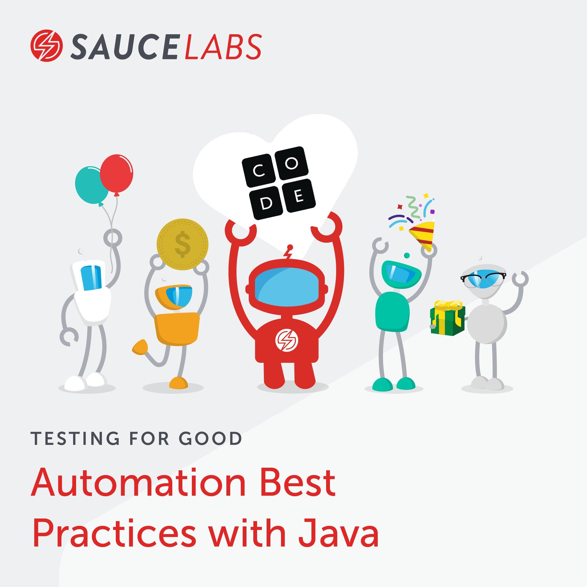
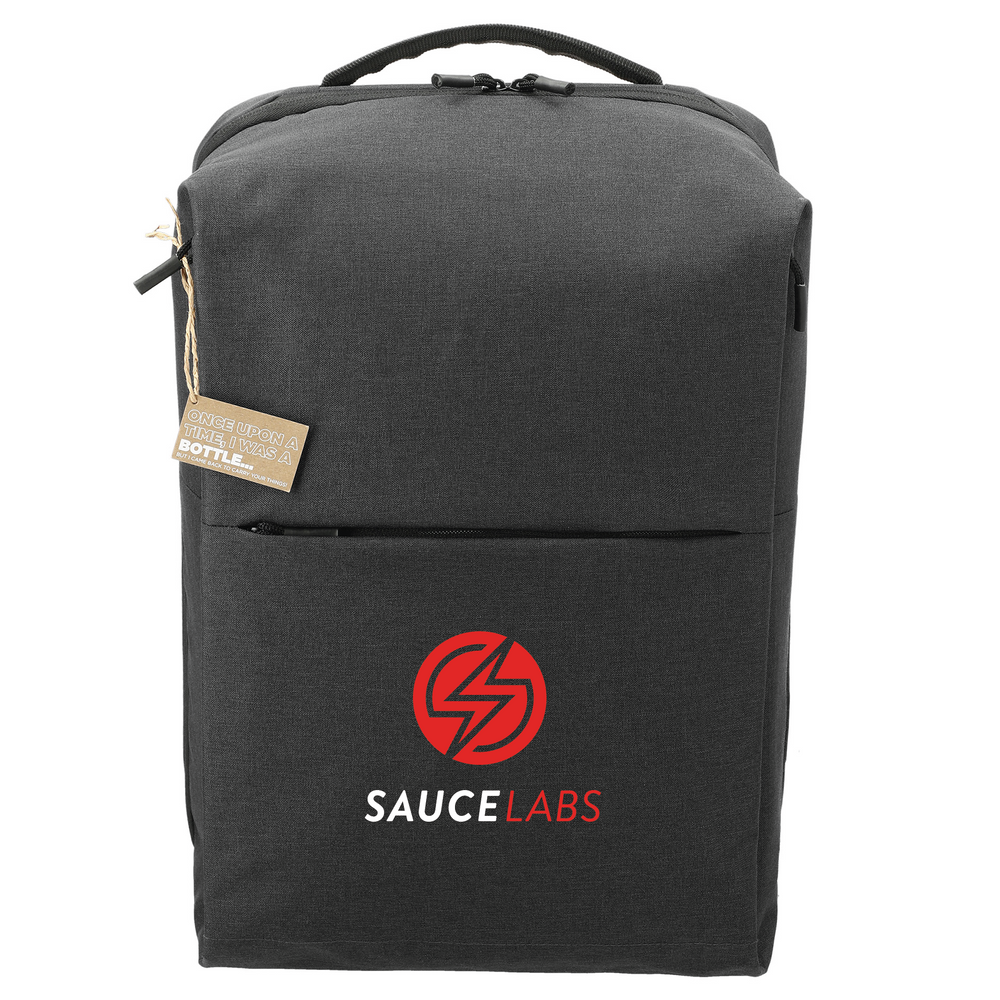

# Automation best practices w/ Java workshop



[#testing4good](https://twitter.com/hashtag/Testing4Good)

In this automation best practices workshop you will learn the latest and greatest tools and techniques to drastically improve your testing!

We will focus on a holistic approach of risk mitigation by doing: 

* functional web testing,
* visual testing,
* accessibility testing, 
* and many other things in between 😁

[👉**Register for workshop**](https://info.saucelabs.com/testing-for-good-workshop-java-113021.html)

[Join Slack](https://join.slack.com/t/testingforgood/shared_invite/zt-zc64x3pc-9ebUXVeXW1fB0JxU1R_9ew)

**This workshop serves 2 purposes**

1. For me to give back to the testing world and help us all upskill 🚀
2. For us all to help a greater cause than ourselves 🌍

### [ABOUT CHARITY](https://code.org/)

Code.org® is a nonprofit dedicated to expanding access to computer science in schools and increasing participation by young women and students from other underrepresented groups. Their vision is that every student in every school has the opportunity to learn computer science as part of their core K-12 education. The leading provider of K-12 computer science curriculum in the largest school districts in the United States, Code.org also created the annual Hour of Code campaign, which has engaged more than 15% of all students in the world.

**Working together, we can reduce the digital divide!**

With the Testing for Good event, we're helping to give every student the opportunity to learn computer science — online and in schools where Code.org  will establish permanent courses and train teachers. For every dollar you donate, one child will be introduced to computer science.

To make your donations go even further, Sauce Labs will match up to $2,500.

👇👇👇

[Please donate whatever you feel appropriate.](https://www.gofundme.com/f/testing-for-good-codeorg) 100% of the donations go to the cause.

## 🧠You will learn to

* Create a framework for doing comprehensive web testing
* Use industry-standard best practices
* Create functional browser tests using Selenium
* Code visual e2e tests using Screener
* Run in massive parallel (100s of tests in < 5 min)
* Automatically get robust test reports with logs + videos

## 🔧Technologies you will use

1. Sauce Labs
2. Selenium
3. Sauce Visual
4. Github Actions
5. Java
6. Maven

## Table Of Contents

* Introduction to workshop
* [Local environment setup](#local-environment-setup)
  * [If you can't setup local, then use Gitpod](#gitpod-setup)
* [E2E browser tests](./workshop/docs/E2E-TESTS.MD)
* [Atomic tests](./workshop/docs/ATOMIC-TESTS.MD)
* [Visual e2e tests](./workshop/docs/VISUAL.MD)
* [Parallelization](./workshop/docs/PARALLEL.MD)
* [Conclusions](./workshop/docs/CONCLUSIONS.MD)


## Requirements

**This is NOT a beginners course and you will not learn Java testing fundamentals here. However, you will learn a number of amazing skills, techniques, and tools to help you test web applications**

* At least 1 year of Java programming
* Deep understanding of Selenium WebDriver
* Deep understanding of OOP
* Java 8 installed
* Java IDE installed
* [Git](https://git-scm.com/downloads)
* [Maven installed](https://maven.apache.org/install.html)


## Your Instructor: Nikolay Advolodkin


- 🔭 I’m the founder of [Ultimate QA](https://ultimateqa.com/)
- 🏢 I’m a Sr Solutions Architect at Sauce Labs
- 🌱 I’m currently working on [Sauce Bindings](https://github.com/saucelabs/sauce_bindings)
- 💬 Ask me about environmentalism, veganism, test automation, and fitness
- 😄 Pronouns: he/him
- ⚡ Fun fact: I'm a vegan that's super pasionate about saving the planet, saving animals, and helping underpriveleged communities
- 📫 Follow me for testing and dev training
  - [Java Testing Newsletter](https://ultimateqa.ck.page/selenium-java-tips
    )
  - [Youtube](https://youtube.com/ultimateqa)
  - [LinkedIn](https://www.linkedin.com/in/nikolayadvolodkin/)
  - [Twitter](https://twitter.com/Nikolay_A00)

## Your TAs 

### Eyal Yovel


### Chris Eccleston


## Setup

### Sign up for account

1. Free [Sauce account](https://saucelabs.com/sign-up)
2. Request [Demo Secreener account](https://saucelabs.com/demo-request-vt). **!You must request this at least a week before the workshop as it's a manual process to add users.** 

### Get your username and api key

1. Save your Sauce Labs Username and Access Key by going to the [Sauce Labs user settings page](https://app.saucelabs.com/user-settings)
2. Save your Screener API Key by going to the [API key](https://screener.io/v2/account/api-key) page in your Screener settings
   1. Need to sign up for [demo account before](https://saucelabs.com/demo-request-vt)


### Local environment setup

Fork then clone the repo

1. Sign up for a free [GitHub account](https://github.com/)
2. [Fork this repository](https://docs.github.com/en/get-started/quickstart/fork-a-repo)
 * Make sure you are logged into GitHub
 * Click the Fork in the upper right of the GitHub.
3. Clone your fork of the repository to your machine. Must have [Git installed](https://git-scm.com/downloads)

```bash
git clone URL_OF_YOUR_FORK
```

Setup environment variables on your system
* [Mac/Linux](https://docs.saucelabs.com/basics/environment-variables/#setting-up-environment-variables-on-macos-and-linux-systems)
* [Windows](https://docs.saucelabs.com/basics/environment-variables/#setting-up-environment-variables-on-windows-systems)

Navigate to the directory of where you cloned your repo

`cd YOUR_FORK_DIR/automation-best-practices/workshop`

Run sanity tests

```java
mvn test -Dtest=SanityTest -X
```

<br/>
  <details>
    <summary>
      <strong>Click here</strong> to see an example console output.
    </summary>

        
        Tests run: 2, Failures: 0, Errors: 0, Skipped: 0, Time elapsed: 54.305 sec

        Results :

        Tests run: 2, Failures: 0, Errors: 0, Skipped: 0

        [INFO] ------------------------------------------------------------------------
        [INFO] BUILD SUCCESS
        [INFO] ------------------------------------------------------------------------
        [INFO] Total time:  56.063 s
        [INFO] Finished at: 2021-11-03T16:03:20-04:00
        [INFO] ------------------------------------------------------------------------
        
  </details>

</br>


### ✅👏Environment setup is complete if tests passed

> If you weren't successful at setting up you local env, then use the [Gitpod approach](#gitpod-setup)👇

### Add static code analysis

:information_source: Optional Bonus

* Follow [Codacy instructions to setup static code analysis for your first repo](https://docs.codacy.com/getting-started/codacy-quickstart/)
* Adding and analyzing takes a bit
* [Configure code patterns for the repo](https://docs.codacy.com/repositories-configure/configuring-code-patterns/#pattern-filters)

---

### Gitpod setup


:information_source:&nbsp; Gitpod lets you run an entire Dev environment from a browser! You can use this approach if you don't know how to setup a local Java environment.

1. Sign up for a free [GitHub account](https://github.com/)
2. Fork this repository
    * Make sure you are logged into GitHub
    * Click the fork in the upper right of GitHub
    * Select your username as the location to fork the repo
3. In the browser address bar, prepend the GitHub url (`https://github.com/USERNAME/automation-best-practices-java`) with `https://gitpod.io/#`
    * The resulting url should look as follows:
   
      > https://gitpod.io/#https://github.com/USERNAME/automation-best-practices-java
   
4. Once the Gitpod.io URL is loaded, you will need to sign in with the GitHub account you created earlier 
5. Once the development environment is loaded, you should see 'Ready to test!' in the Terminal window in the lower portion of the window, run the following commands in that Terminal to set your `SAUCE_USERNAME`, `SAUCE_ACCESS_KEY`, and `SCREENER_API_KEY`:

:information_source:&nbsp; You can get your Sauce Labs Username and Access Key by going to the [Sauce Labs user settings page](https://app.saucelabs.com/user-settings)

:information_source:&nbsp; You can get your Screener API Key by going to the [API key](https://screener.io/v2/account/api-key) page in your Screener settings

```bash
eval $(gp env -e SAUCE_USERNAME=<sauce_username>)
eval $(gp env -e SAUCE_ACCESS_KEY=<sauce_access_key>)
eval $(gp env -e SCREENER_API_KEY=<screener_api_key>)
```

> Replace <sauce_username>, <sauce_access_key>, and <screener_api_key> with your credentials

Once you have run those 3 commands, you can run the following commands to test your environment variables:

```bash
echo $SAUCE_USERNAME
echo $SAUCE_ACCESS_KEY
echo $SCREENER_API_KEY
```

Run sanity tests

```bash
mvn test -Dtest=SanityTest -X
```

<br/>
  <details>
    <summary>
      <strong>Click here</strong> to see an example console output.
    </summary>


        Tests run: 2, Failures: 0, Errors: 0, Skipped: 0, Time elapsed: 54.305 sec

        Results :

        Tests run: 2, Failures: 0, Errors: 0, Skipped: 0

        [INFO] ------------------------------------------------------------------------
        [INFO] BUILD SUCCESS
        [INFO] ------------------------------------------------------------------------
        [INFO] Total time:  56.063 s
        [INFO] Finished at: 2021-11-03T16:03:20-04:00
        [INFO] ------------------------------------------------------------------------

  </details>

<br/>


### ✅👏Environment setup is complete if tests passed

## Stay to the end and win a prize!

Stay to the end and 2 lucky people can win a snazzy Back Pack!



## Key

💡 this is a tip

🏋️‍♀️ this is an exercise for you to do

❓ this is a question for us to think and talk about. Try not to scroll beyond this question before we discuss


