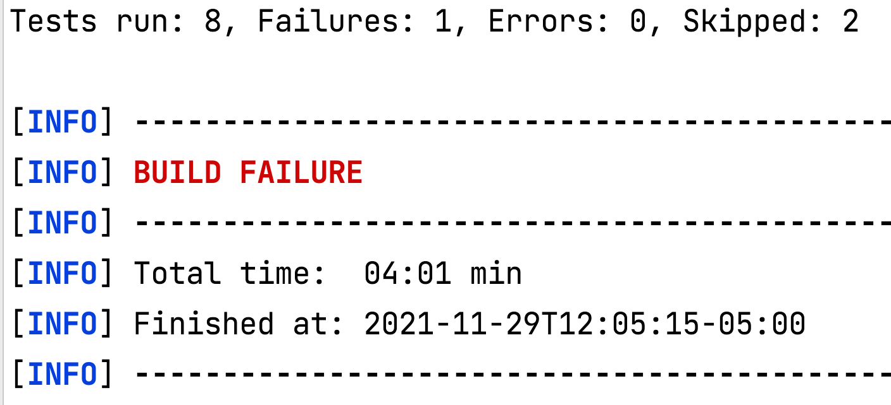
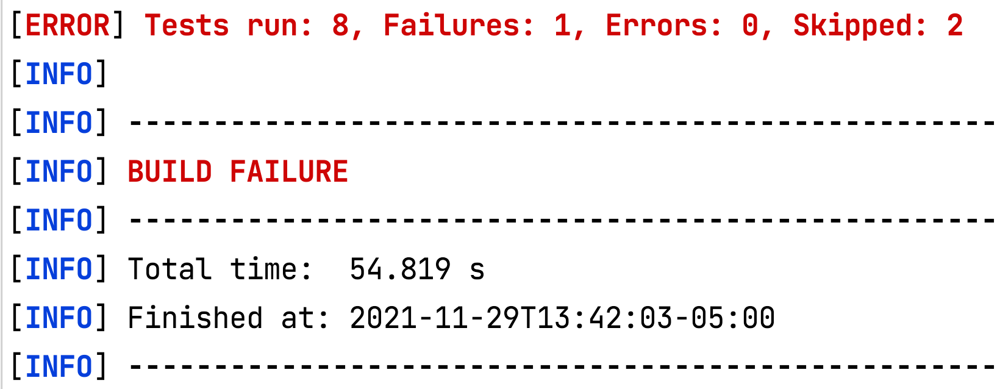

# Parallel Execution


## 🧠You will learn

✅ How to create ridiculously fast test suites

✅ How to implement parallelization

## In today's world, it's improbable to succeed without parallelization

> "Once you have these automated tests, our analysis shows it’s important to run them regularly. Every commit should trigger a build of the software and running a set of fast, automated tests. Developers should get feedback from a more comprehensive suite of acceptance and performance tests every day. Furthermore, current builds should be available to testers for exploratory testing." (Nicole Forsgren PhD, Jez Humble, Gene Kim, Accelerate: The Science of Lean Software and DevOps: Building and Scaling High Performing Technology Organizations)

Try to run the current suite of tests:

```text
mvn test -Dtest="E2ESolutionTests,VisualDataDrivenSolutionTests"
```

This is how long my tests took



241 sec/8 tests = 30 sec/test

---

### ❓What's the problem with this approach?

---

## 🏋️‍♀Implement parallelization

1. Go to `pom.xml` and add the following at the same level as the `<dependencies>` node

```xml
    <build>
        <plugins>
            <plugin>
                <groupId>org.apache.maven.plugins</groupId>
                <artifactId>maven-surefire-plugin</artifactId>
                <version>3.0.0-M5</version>
                <configuration>
                    <parallel>all</parallel>
                    <threadCountMethods>100</threadCountMethods>
                    <useUnlimitedThreads>true</useUnlimitedThreads>
                    <redirectTestOutputToFile>false</redirectTestOutputToFile>
                </configuration>
            </plugin>
        </plugins>
    </build>
```

2. In terminal run 

```text
mvn test -Dtest="E2ESolutionTests,VisualDataDrivenSolutionTests"
```

3. Login to saucelabs.com and watch tests run in parallel

My results



## What we just achieved ✅💪

✅ 78% speed improvement in < 5 min

✅ 0 degradation to our test quality

✅ Enabled parallel scaling

## 📝Summary

✅ Parallel testing is awesome

## Extra resources

[Achieving 97% test suite run time improvement](https://devops.com/4-steps-to-achieve-a-66-reduction-in-test-run-time/)

## [⏭️Let's summarize](CONCLUSIONS.MD)
